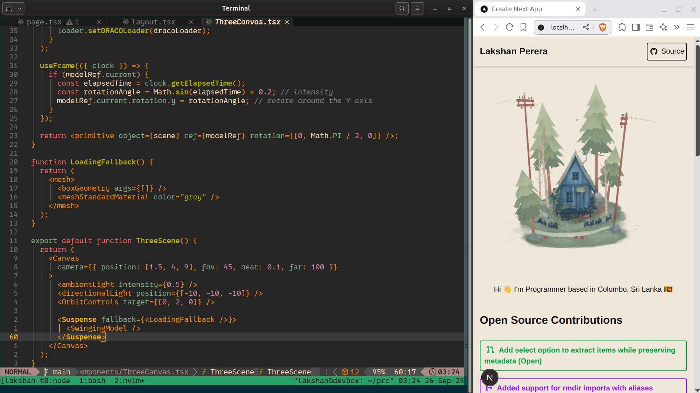

# Lakshan's Portfolio

[https://github.com/0xlakshan/portfolio](https://github.com/0xlakshan/portfolio)


## Stack

- [Next.js](https://nextjs.org/) - A React framework with hybrid static & server rendering, and route pre-fetching, etc.
- [TailWind CSS](https://tailwindcss.com/) - A simple, utility-first, and customizable CSS framework for rapidly building modern websites.
- [Three.js](https://threejs.org/) - 3D library for JavaScript
- [PostHog](https://posthog.com/) - Analytics

## Project Structure

```
Project Root
├── public
│   ├── draco # WebAssembly decoder files
│   └── models # Model file
├── src
│   └── app
└── components
    ├── foresthouse # Model Component
    ├── layout 
    │   └── ui # Theme Components
    └── sections # Component Files
```

